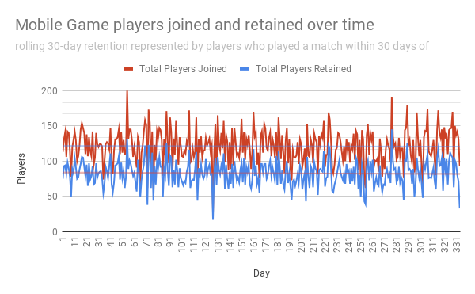
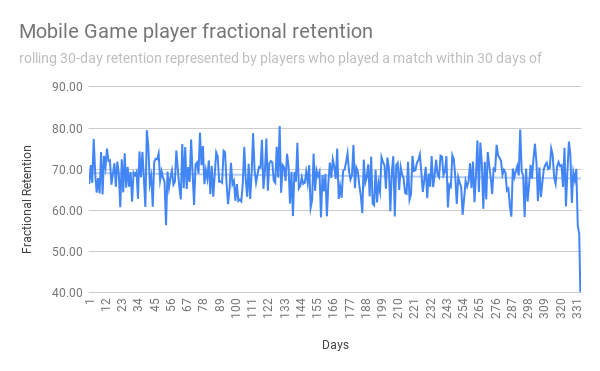
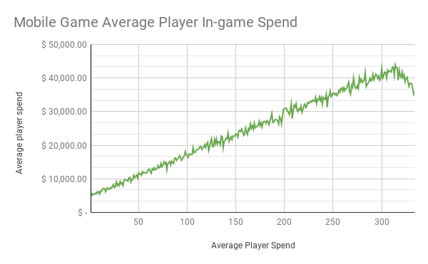

# Project 1 Read Me file 
## description of queries and visualizations
 
For this project I was provided 4 data sets from a mobile game company, spanning 365 days of user data including  number of players who joined,  player location, game play, in-game purchases and frequency of game play. I took a marketing and operations perspective on my analysis, where I wanted to demonstrate location specific outliers in the data and any spikes in retention rates as well as the overall rolling retention rates, based on players who played a game within 30 days of joining. 

I used SQL to aggregate the data and then Google Sheets to analyze the tables created and visualize my findings. 

Link to tables and charts in Google Sheets:
https://docs.google.com/spreadsheets/d/1HEe5ZN6mGIPQ_SKQTxWAWoNcEbMfXXSegHDtj3MaxFE/edit?usp=sharing
 
## Query 1
Description 
 
For the first query  I aimed to create a table that displayed the date in questions, the number of players who joined on that day, from the number of those players that joined, the number retained and the fractional retention. 
 
Approach
 
To create the desired columns I created multiple sub queries: 
 
First I determined that the three of the columns were located in files player_info and match_info, both of these tables I inner joined by player_id, however they needed to be aggregated. I grouped the player_id and joined day and used the max function on the day column from the match info to find the most current game that each player played. 
 
Next I took the advice of the hints provided and used a case statement to create a fourth column “retained” that indicated 1 for players who had played a game within 30 days of joining, and a 0 for those who didn’t play a game or played outside of 30 days of joining. 
 
Then I aggregated the players with the count function and found the retained numbers for each day by using sum and grouped by the joined day. 
 
Finally I needed to create the fourth column of fractional retention, dividing the total_retained by total_players, multiplying by 100 to display the number as a percentage and rounding to 2.
 
Visualization
Before preparing the visualization I excluded the last 30 days of data as there was no retentional info provided, I didn’t want these 30 days to skew the analysis. 
 
I created two line charts from this table, one to visualize the players who joined each day and the number of players retained, based on 30 day rolling retention and the second chart demonstrating the 30 day fractional retention over 335 days.

 
In chart one you can see that the visualization doesn’t point out any specific patterns day over day for players joined and retained, the retained numbers rise and fall along with the total players who joined. The trendline for both metrics are flat, retained number sits at 84 and players joined at 122.

 
In chart two the fractional retention trendline does start to dip slightly near the end of the 335 day however, this could be  explained by not having all of the player data past 365 days. Again, there are no trends or outliers that seem to stand out, the trendline sits around 69 consistently. 
 
When speaking about retention metrics with the game company I would conclude that the retention metrics are for the most part steady and in an effort to reduce churn further and increase retention would be to grow the player join numbers over all. 
 
## Query 2
 
Description
I wanted to further analyze the data with an operations and marketing lens, focusing on the regional information to find the retention rates and average amount players spend on in-game purchases. 
 
Approach
 
For this second analysis I used similar queries that I utilized in the first query but instead of grouping by join day I grouped the data by location, keeping the aggregated retained data in place. I also joined the remaining two tables, purchase_info and item_info to look at the average in- game spend paid by location.
 
Visualization
For this table visualization I used a bar chart to show the total average in-game spend, total players joined and total players retained, grouped by location. 

 
In chart 3 the most interesting thing that is demonstrated across all locations is that the numbers remain flat, no significant differences can be seen. This is particularly interesting as you might assume that there is a region where the game might be more or less popular and therefore you might see a lower or higher in-game spend. The trendline for in-game spends is $24,394, for players joined 6,741 and players retained 4,603.
 
## Query 3
 
Description
After finding no significant outliers in the retention or average purchases made by location I wanted to look at the average spent on in game purchases grouped by players and the day they joined. 
 
Approach
 
I used a similar structure to query 1 and again, joined all four tables available, keeping the group by clauses as player_id and then day joined. In regards to the price, in the first subquery I sumed the price as total_spent, then averaged the spend and finally rounded to 2. 
 
Visualization

 
Perhaps the most interesting visualization and finding, in chart 4 you can see that the average in-game spend per player increases significantly by players who joined later in the game lifecycle. This means that of those players that had less time in the game spent more than the players who joined early on. I would suggest to the mobile game marketing and operations team to look closely at why this increase in player spends might be so they can continue to encourage in-game spends. I would encourage them to add in-game spends to their KPIs as well as player retention. 
 
 
 
